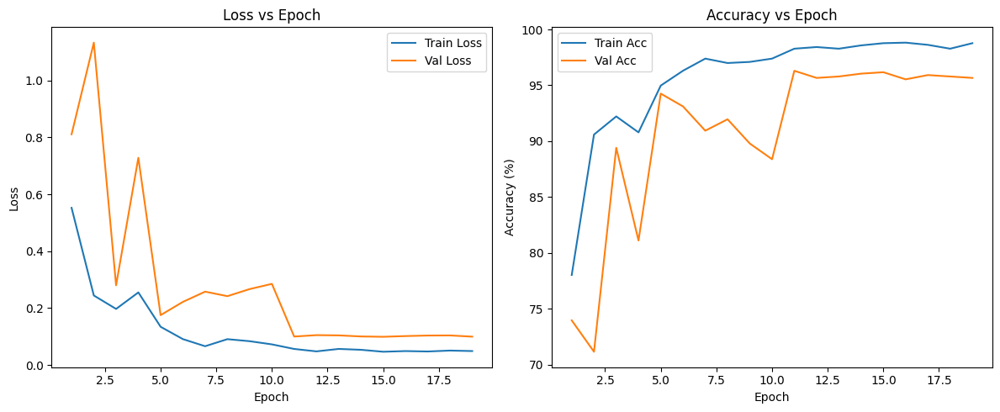
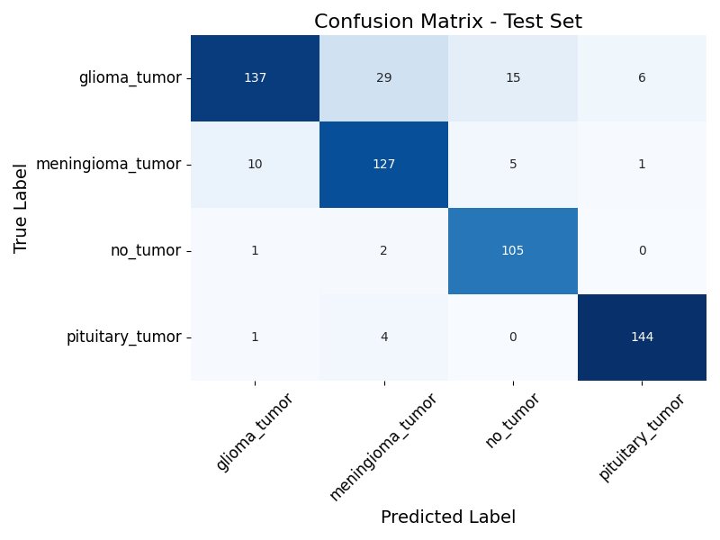
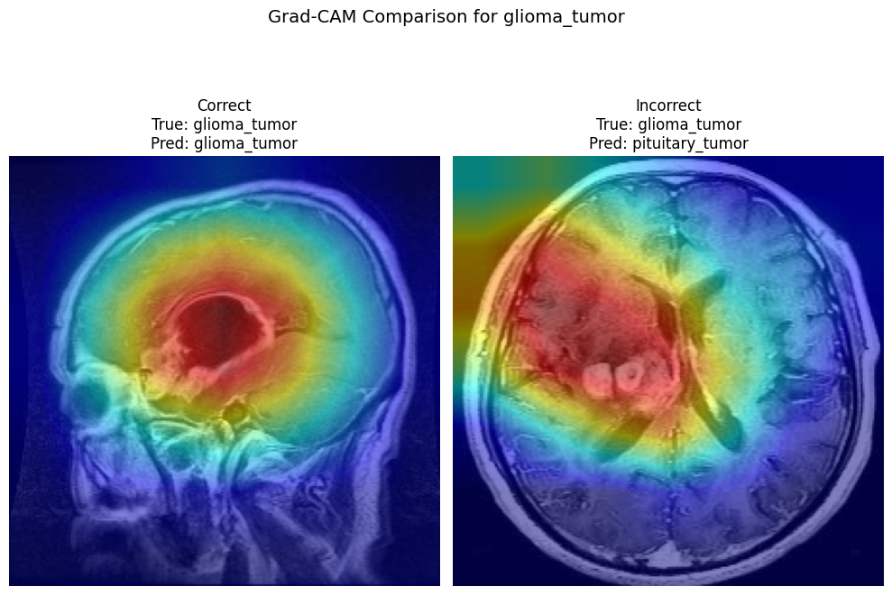

# 🧠 MRI Brain Tumor Classification

This project demonstrates a complete deep learning pipeline for classifying brain MRI scans into different tumor categories (glioma, meningioma, pituitary, or no tumor). The project emphasizes **medical data understanding**, **model interpretability**, and **ethical AI use**.


## 🏗️ Model Architecture
This project uses the ResNet18 convolutional neural network architecture, which is a pretrained architecture suitable for imaging tasks due to its balance of depth and computational efficiency.

<details>
  <summary>Model Architecture Details</summary>

ResNet18 consists of:
- An initial convolutional layer 
- Four sequential blocks, each containing two "BasicBlocks" (each block has two convolutional layers and a shortcut connection) (16 layers)
- A global average pooling layer
- A fully connected output layer

There are a total of 18 layers. 
The shortcut (residual) connections help prevent vanishing gradients, enabling deeper networks to learn effectively. The model is adapted for grayscale MRI images and trained with class weights to address imbalance.

</details>


## 🚀 Objectives
- Explore and preprocess MRI brain images.
- Train a convolutional neural network (CNN) using transfer learning.
- Evaluate performance with medical metrics (sensitivity, specificity, ROC-AUC).
- Apply explainability techniques (Grad-CAM) to interpret model predictions.
- Discuss limitations, bias, and ethical considerations.
- Reproducible pipeline.

---

## Project Structure

The file tree below shows the entire project structure. Se notebooks for step-by-step workflow.

```
mri-brain-tumor-classification/
├── assets
│   ├── class_distribution.png
│   ├── confusion_matrix.png
│   └── training_curves.png
├── data
│   ├── brain_tumor_dataset
│   ├── eda_findings.json
│   └── processed
├── deploy
│   ├── app.py
│   ├── README.md
│   ├── requirements.txt
│   ├── static
│   └── templates
├── models
│   └── resnet18_brain_tumor_weights.pth
├── notebooks
│   ├── 01_explore_data.ipynb
│   ├── 02_preprocessing.ipynb
│   ├── 03_train_model.ipynb
│   ├── 04_explainability.ipynb
│   ├── duplicates.log
│   ├── train_accs.npy
│   ├── train_losses.npy
│   ├── val_accs.npy
│   └── val_losses.npy
├── pyproject.toml
├── README.md
├── requirements.txt
└── src
    ├── __init__.py
    ├── mri_brain_tumor
    └── mri_brain_tumor.egg-info
```

## 🩺 Dataset
**Source:** [Kaggle Brain Tumor MRI Dataset](https://www.kaggle.com/datasets/sartajbhuvaji/brain-tumor-classification-mri) 

**Description:**  
Contains MRI images classified into four groups:
- Glioma Tumor  
- Meningioma Tumor  
- Pituitary Tumor  
- No Tumor  

All data is anonymized and used for educational purposes only. 

## ⚖️ Why Class Imbalance Matters
Class imbalance occurs when some classes (e.g., 'no_tumor') are underrepresented compared to others. In medical imaging, this can cause the model to be biased toward predicting the majority classes, potentially missing critical cases. In a clinical setting, this could lead to missed diagnoses of rare tumor types. To mitigate the effect of class imbalance, weights are used in the loss function, penalizing errors on minority classes more heavily and improving diagnostic reliability.

An image of the class distribution is shown below after the data is cleaned. Most notably, the 'no_tumor' class contains fewer images than any of the tumor-containing classes. As a result, class weights are implemented into the loss calculation to penalize misclassifications of 'no_tumor' images more heavily during training. 


---

## 🧠 Methodology
1. **Data Exploration**
    - [01_explore_data.ipynb](notebooks/01_explore_data.ipynb): Visualizes dataset structure, class distribution, image quality, and outlier detection.
2. **Preprocessing**
    - [02_preprocessing.ipynb](notebooks/02_preprocessing.ipynb): Resizes images, applies CLAHE for contrast normalization, removes duplicates, handles class imbalance, and creates train/val/test splits.
3. **Model Training and Evaluation**
    - [03_train_model.ipynb](notebooks/03_train_model.ipynb): Implements and trains ResNet18 with class weights, tracks training/validation curves, and saves model weights. It also computes precision, recall, F1, ROC, confusion matrix, and analyzes false positives/negatives.
4. **Explainability**
    - [04_explainability.ipynb](notebooks/05_explainability.ipynb): Applies Grad-CAM to visualize model attention and interpret predictions.
5. **Ethics & Limitations discussion**
    - Discusses dataset bias, clinical limitations, and ethical considerations for AI in medicine.

---

## 🧮 Loss Function

The model uses **CrossEntropyLoss** for multi-class classification.  
To address class imbalance (especially the underrepresented 'no_tumor' class), class weights are computed from the training set and passed to the loss function. This ensures that errors on minority classes are penalized more heavily, improving diagnostic reliability.

---

## How to Run This Project


1. **Clone the repository:**
   ```bash
   git clone https://github.com/zkhechadoorian/mri-brain-tumor-classification.git
   cd mri-brain-tumor-classification
   ```

2. **Create a Python virtual environment (recommended):**
   ```bash
   python3 -m venv .venv
   source .venv/bin/activate
   ```

3. **Install required packages:**
   ```bash
   pip install -r requirements.txt
   ```

4. **Download and place the dataset:**
   - Download the [Kaggle Brain Tumor MRI Dataset](https://www.kaggle.com/datasets/sartajbhuvaji/brain-tumor-classification-mri).
   - Place the extracted data in the `data/brain_tumor_dataset` directory.

5. **Run the notebooks:**
   - Open the `notebooks` folder in VS Code or Jupyter.
   - Follow the workflow from `01_explore_data.ipynb` through `04_explainability.ipynb`.

**Tip:**  
If running on a cloud platform (e.g., Colab or Kaggle), upload the dataset and adjust paths as needed.

---

## 🧪 Results (example placeholder)

The learning curves below show training and validation loss and accuracies through each epoch. Early stopping was implemented such that the model would automatically stop training if no improvements were seen in validation loss after 5 epochs. 



The best model, as determined from the lowest validation accuracy, was used to create the evaluation metrics shown below. The 



| Class | Precision | Recall | F1-Score | Support |
|---|---|---|---|---|
| Glioma | 0.92 | 0.73 | 0.82 | 187 |
| Meningioma | 0.73 | 0.91 | 0.81 | 143 |
| No Tumor | 0.92 | 0.90 | 0.91 | 108 |
| Pituitary | 0.94 | 0.97 | 0.95 | 149 |

Example Grad-CAM heatmap:  


---

## ⚖️ Ethical Statement
This model is **for research and educational purposes only**.  
It is **not a diagnostic or clinical decision tool**.  
All data used is publicly available and de-identified.

---

## 🔭 Future Improvements

- **Explore Alternative Loss Functions:**  
  Investigate how the model performs with different loss functions (e.g., focal loss, label smoothing, or Dice loss) to further address class imbalance and improve robustness.

- **Advanced Explainability Techniques:**  
  Extend model interpretability beyond Grad-CAM by experimenting with other methods such as Integrated Gradients, LIME, or SHAP to gain deeper insights into model decision-making.

- **Web Application Deployment:**  
  Develop and deploy a user-friendly web application that allows clinicians or researchers to upload MRI images and receive real-time predictions, making the model accessible for practical use and demonstration.

- **Additional Ideas:**  
  - Hyperparameter optimization (e.g., using Optuna or Ray Tune)
  - Ensemble modeling for improved accuracy
  - Data augmentation strategies tailored for medical imaging
  - External validation on independent datasets


## 📚 References
- Bhuvaji et al., *Brain Tumor Classification (Kaggle)*  
- Rajpurkar et al., *AI in Radiology: The Challenges of Generalization* (Nature Medicine, 2022)
